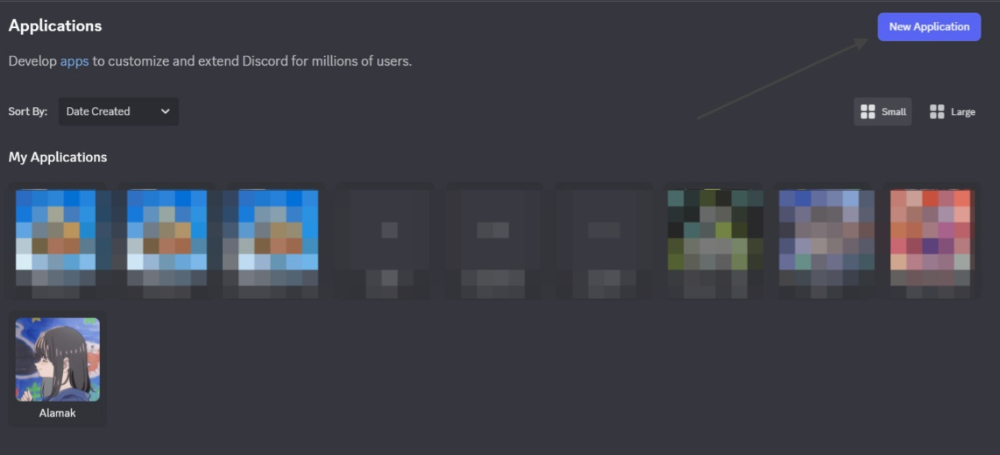
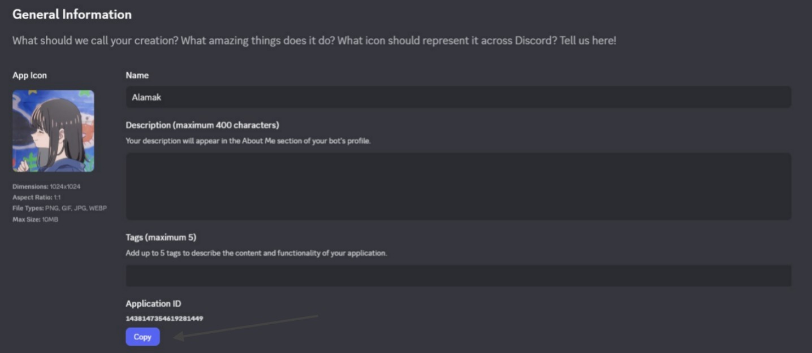
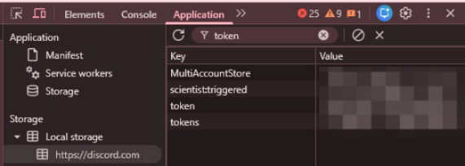

> [!CAUTION]
> **The use of this module under a different name on NPM (or another source besides this Github) is not associated with this library.**
> **When using these libraries, you accept the risk of exposing your Discord Token.**

# DC_RPC

Discord Rich Presence using Node.js

## 🚀 Installation Guide

1. **Clone the repository**
   ```bash
   git clone https://github.com/ItzApipAjalah/DC_RPC
   cd DC_RPC
   ```

2. **Install dependencies**
   ```bash
   npm install
   ```

3. **Configure `config.js`**
   - Open the `config.js` file
   - Fill in your `application_id` with your own Application ID from [Discord Developer Portal](https://discord.com/developers/applications)

    
    
    
4. **Get Your Discord Token**
   ⚠️ **Warning:** Your account token is sensitive — never share it with anyone.

   - Go to [discord.com/app](https://discord.com/app)
   - Press **Ctrl + Shift + I** to open DevTools
   - Navigate to the **Application** tab
   - On the left, select **Local Storage → https://discord.com**
   - Type `token` in the filter bar
   - A key named `token` will appear — that’s your Discord token  
     (Use the device toolbar toggle if it doesn’t appear)

   

5. **Create `.env` file**
   Create a file named `.env` in your project folder, then add:
   ```env
   TOKEN=YOUR_TOKEN
   ```

6. **Run the project**
   ```bash
   node index.js
   ```

---

## 📜 Notes
- Make sure Node.js is installed on your system.
- Never share your token with anyone to keep your account safe.
- If you encounter any errors, ensure that both your `application_id` and `token` are correct.

---

> [!WARNING]
> **I don't take any responsibility for blocked Discord accounts that used this .**

> [!CAUTION]
> **Using this on a user account is prohibited by the [Discord TOS](https://discord.com/terms) and can lead to the account block.**